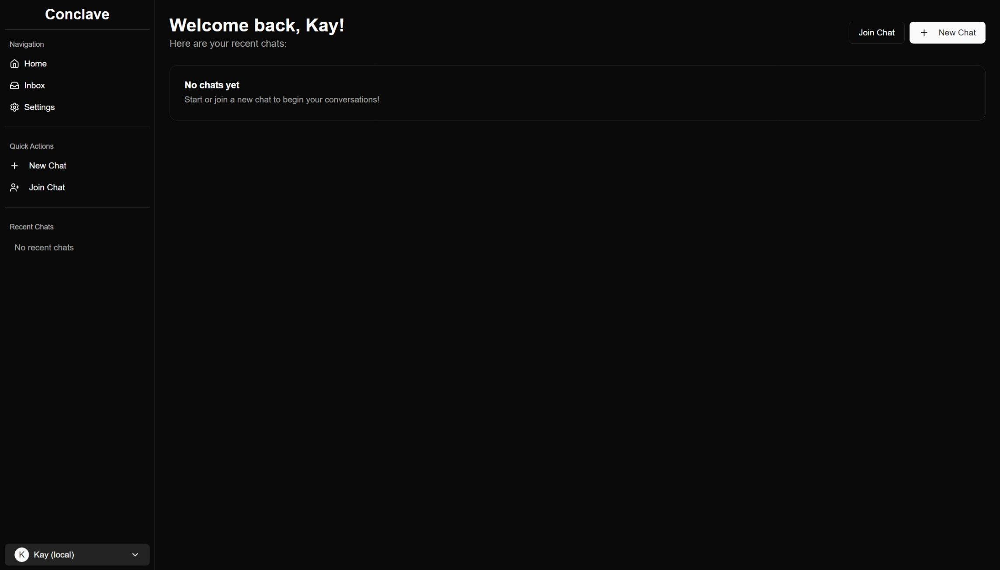
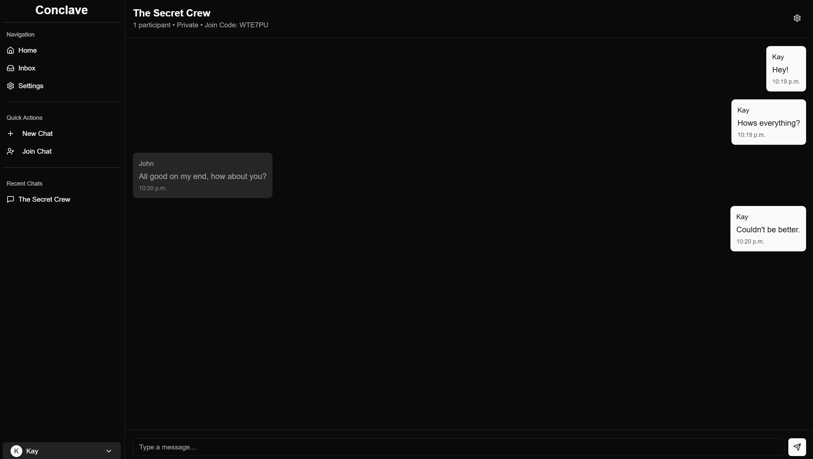

<div align="center">

# Conclave
### Multi-User AI Chat Platform (WIP)

A real-time chat application that allows users to create group conversations with both humans and AI participants. Built with Next.js, Socket.IO, and Firebase, this platform makes collaborative AI interactions seamless and intuitive.

[Bug Report](https://github.com/kayroye/conclave/issues)


</div>

## 📸 Screenshots

### Home Page


### Chat Interface

*Real-time chat interface with AI integration*

## ✨ Features

<details>
<summary>💬 Real-Time Chat</summary>

- Socket.IO-powered real-time messaging
- Group conversations with multiple participants
- Message history and infinite scrolling
- Join chats via unique codes
</details>

<details>
<summary>🤖 AI Integration</summary>

- Add multiple AI participants to any chat
- Support for various AI providers (OpenAI, Anthropic, Google, Ollama)
- Customizable AI system prompts
- Stream AI responses in real-time
</details>

<details>
<summary>👥 User Management</summary>

- User authentication and profiles
- Personal API key management for AI services
- Chat creation and management
- User preferences
</details>

<details>
<summary>🔒 Privacy & Security</summary>

- Private and public chat options
- Secure API key storage
- Firebase authentication
</details>

## 🛠️ Tech Stack

- **Frontend**: Next.js 15, React 19, Tailwind CSS, shadcn/ui
- **Backend**: Node.js, Express, Socket.IO
- **Database**: Firebase Firestore
- **Authentication**: Firebase Authentication
- **AI Integration**: OpenAI, Anthropic, Google Generative AI, Ollama

## 🚀 Getting Started

### Prerequisites

- Node.js 18+
- npm/yarn/pnpm
- Firebase account
- API keys for desired AI providers (OpenAI, Anthropic, Google)

### Installation

1. Clone the repository

```bash
git clone https://github.com/dsmas/conclave.git
```

2. Install dependencies
```bash
cd conclave
npm install
```

3. Set up environment variables
```bash
cp .env.example .env.local
```

Fill in your environment variables:
```bash
NEXT_PUBLIC_FIREBASE_API_KEY=your_firebase_api_key
NEXT_PUBLIC_FIREBASE_AUTH_DOMAIN=your_firebase_auth_domain
NEXT_PUBLIC_FIREBASE_PROJECT_ID=your_firebase_project_id
NEXT_PUBLIC_FIREBASE_STORAGE_BUCKET=your_firebase_storage_bucket
NEXT_PUBLIC_FIREBASE_MESSAGING_SENDER_ID=your_firebase_messaging_sender_id
NEXT_PUBLIC_FIREBASE_APP_ID=your_firebase_app_id
NEXT_PUBLIC_APP_URL=http://localhost:3000
```

4. Run the development server
```bash
npm run dev
```

Visit [http://localhost:3000](http://localhost:3000) to see the application.

## 💡 Why Conclave?

Conclave solves the problem of fragmented AI conversations by bringing everyone together in a single space. Instead of each person having separate conversations with different AI assistants, Conclave allows teams, friends, or communities to collaborate in group chats that include both humans and AI participants.

Key benefits:
- **Shared Context**: Everyone sees the same conversation and AI responses
- **Multiple AI Perspectives**: Add different AI models to the same conversation
- **Collaborative Learning**: Learn from how others interact with AI
- **Streamlined Communication**: No need to copy/paste AI responses between different platforms

## 📄 License

This project is licensed under the MIT License - see the [LICENSE](LICENSE) file for details.

## Acknowledgments

- [Socket.IO](https://socket.io) for real-time communication
- [Firebase](https://firebase.google.com) for authentication and database
- [shadcn/ui](https://ui.shadcn.com) for the UI components
- [OpenAI](https://openai.com), [Anthropic](https://anthropic.com), and [Google](https://ai.google.dev) for AI capabilities
